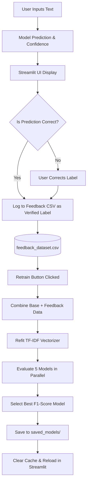

# 🛡️ Interactive Self-Improving Spam Classifier


🌐 **Live Demo:** (https://spam-classifier-tac.streamlit.app/)


An end-to-end Machine Learning system to detect whether a given message (Email, SMS, or text) is **Spam / Phishing** or **Safe (Ham)**. This project is upgraded from a basic spam classifier to an **interactive self-improving NLP system** featuring a Human-in-the-Loop (HITL) active learning feedback loop, automatic feedback collection, and dynamic model retraining.

---


## 🚀 Features

- **Human-in-the-Loop Feedback Loop**: Users can submit corrective feedback directly from the Streamlit web application when the model makes an incorrect prediction.
- **Automatic Feedback Aggregation**: Submissions are automatically parsed, preprocessed, and stored in a local feedback dataset.
- **Dynamic Model Retraining & Auto-Deployment**: A one-click retraining pipeline combined with Streamlit's caching system. It retrains 5 candidate models in parallel (Logistic Regression, SVM, Naive Bayes, Random Forest, XGBoost) on the combined dataset (base + feedback), selects the best-performing model based on F1-score, and automatically swaps it in with zero downtime.
- **Text Preprocessing**: Utilizes `nltk` for stopword removal, tokenization, regex cleaning (URLs/characters), and WordNet Lemmatization.
- **Model Training Pipeline**: Evaluates multiple machine learning algorithms using a `TfidfVectorizer` (up to 10,000 features).
- **Beautiful Streamlit Web App**: A premium glassmorphic UI with dynamic tabs, statistics monitoring, and real-time model metrics comparisons.

---

---

# 📈 Model Performance

| Model | F1 Score |
|---|---|
| Logistic Regression | 0.9851 |
| SVM | 0.9879 |
| Naive Bayes | 0.9782 |
| Random Forest | 0.9724 |
| XGBoost | 0.9843 |

✅ **Best Model:** Support Vector Machine (SVM)

---

## 📂 Project Structure

```text
📦 Spam-Classifier
 ┣ 📂 app
 ┃ ┗ 📜 streamlit_app.py        # Streamlit web application & feedback UI
 ┣ 📂 data
 ┃ ┣ 📂 raw                     # Raw datasets (phishing_legit_dataset_KD_10000.csv, email_spam.csv, spam.csv, SMSSpamCollection)
 ┃ ┗ 📂 processed               # Processed/merged datasets
 ┃   ┣ 📜 processed_spam_dataset.csv # Base preprocessed dataset
 ┃   ┗ 📜 feedback_dataset.csv  # User-submitted active learning feedback [NEW]
 ┣ 📂 saved_models              # Serialized joblib models (.pkl)
 ┃ ┣ 📜 best_spam_classifier.pkl
 ┃ ┗ 📜 tfidf_vectorizer.pkl
 ┣ 📂 src
 ┃ ┣ 📂 models
 ┃ ┃ ┣ 📜 predict.py            # CLI prediction script
 ┃ ┃ ┗ 📜 train_models.py       # Refactored pipeline (programmatic & CLI training)
 ┃ ┗ 📂 preprocessing
 ┃   ┣ 📜 merge_datasets.py     # Aggregates raw datasets into one combined CSV
 ┃   ┗ 📜 text_preprocessing.py # Preprocesses and cleans combined text dataset
 ┣ 📜 .gitignore
 ┗ 📜 README.md                 # Updated documentation
```

---

## 🛠️ Installation & Setup

1. **Clone the repository**
   ```bash
   git clone https://github.com/aryanchand227/Spam-classifier.git
   cd Spam-classifier
   ```

2. **Set up a Virtual Environment (Recommended)**
   ```bash
   python -m venv env
   # On Windows
   .\env\Scripts\activate
   # On Mac/Linux
   source env/bin/activate
   ```

3. **Install Dependencies**
   Ensure you have the required libraries installed:
   ```bash
   pip install pandas scikit-learn xgboost nltk colorama joblib streamlit
   ```

---

## 🧠 Usage

### 1. Run the Streamlit Web App (Recommended UI)
To launch the interactive self-improving web application:
```bash
streamlit run app/streamlit_app.py
```
Navigate to `http://localhost:8501`. Analyze messages under **Message Analysis**, and submit corrections to see them appear in the **Active Learning & Retraining** tab.

### 2. Model Training via CLI
To train the models from scratch using the baseline dataset (and feedback dataset if present):
```bash
python src/models/train_models.py
```

### 3. CLI Prediction
For a quick terminal test, use:
```bash
python src/models/predict.py
```

---

## 🧬 Active Learning & Feedback Architecture



1. **Active Learning (Human-in-the-Loop)**: When predictions are incorrect, users tag the true label. The system saves the raw text, cleaned text, corrected label, and timestamp to a feedback file.
2. **Dynamic Retraining**: The retraining process combines base training data with user feedback, dropping duplicates to prioritize the latest user-corrected labels. The TF-IDF vectorizer refits to learn new vocabulary features, protecting the model from drift.
3. **Hot-Swapping**: Once retraining finishes, the Streamlit resource cache is programmatically cleared, hot-swapping the new model weights into the active server instance.

---

## 📊 Technologies Used

- **Python**: Core programming language.
- **Scikit-Learn & XGBoost**: Feature extraction (`TfidfVectorizer`) and machine learning classifiers.
- **NLTK**: Preprocessing (Stopwords, WordNet Lemmatization).
- **Pandas**: Active learning database management and data frames.
- **Streamlit**: Multi-tab user interface and dynamic retraining execution.
- **Joblib**: Model serialization and hot-swapping.

---

## 💼 Professional Resume Wording

Here is how you can present this project on your resume to showcase advanced machine learning, NLP, and system engineering skills:

* **Interactive Machine Learning System**: *Designed and implemented an end-to-end active learning text classification system featuring a Human-in-the-Loop (HITL) feedback mechanism to collect user corrections, increasing model robustness against data drift.*
* **Multi-Model Retraining Pipeline**: *Built a dynamic retraining pipeline in Python that trains multiple candidate classifiers (Logistic Regression, Support Vector Machines, Random Forest, Multinomial Naive Bayes, XGBoost) using TF-IDF features and automatically deploys the best-performing model based on F1-score.*
* **Full-Stack ML Dashboard**: *Developed an interactive administration dashboard with Streamlit, enabling users to monitor model metrics, review captured feedback, trigger retraining, and automatically reload updated models in memory with zero downtime.*
* **Data Pipelines & Preprocessing**: *Engineered modular preprocessing pipelines (tokenization, stopword removal, WordNet lemmatization, and regex sanitization) that merge raw data sources and handle incremental feedback inputs seamlessly.*

---

## 🔮 Future Upgrades

- **Uncertainty Sampling**: Implement active learning query strategies, prompting users for feedback primarily when the prediction confidence falls within a margin of high uncertainty (e.g., confidence between 40% and 60%).
- **ACID-Compliant Storage**: Migrate the CSV feedback collection to an SQLite or PostgreSQL database to handle concurrent user interactions and guarantee data integrity.
- **Auto-Trigger Retraining**: Set up cron jobs or feedback count thresholds (e.g., automatically trigger retraining every 100 corrections) to keep the classifier updated.
- **Model Drift Monitoring**: Keep a historical record of validation scores across training runs and visualize performance degradation/improvement over time.
